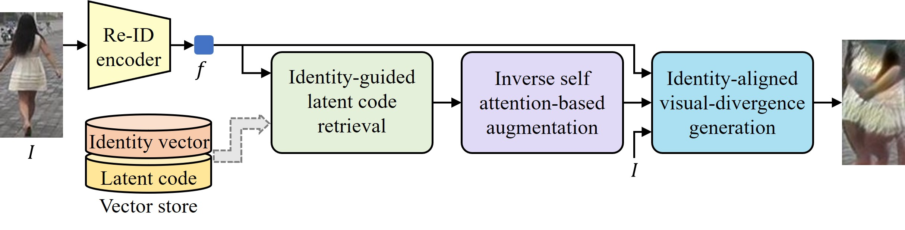
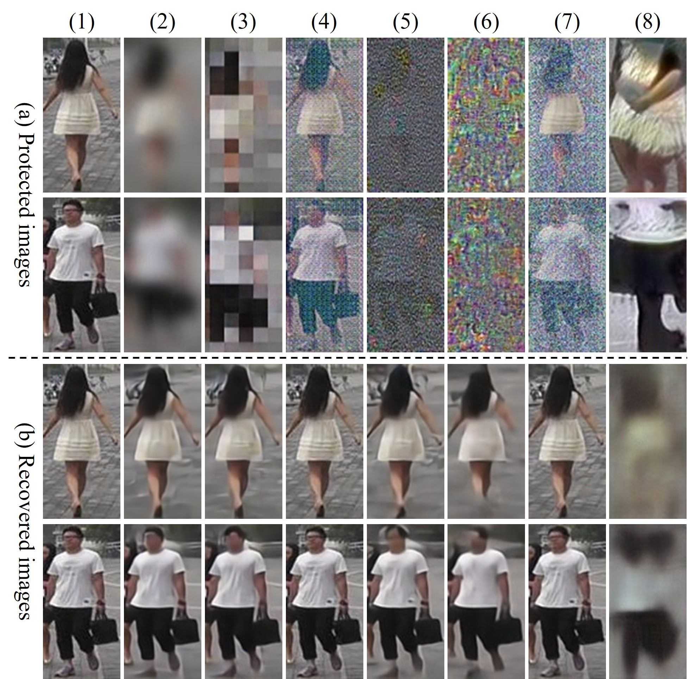

# Latent-RAG: Identity Retrieval-Guided Latent Augmentation for Privacy-Preserving Person Re-Identification

This directory is an independent, runnable implementation of:

> Seung-hyeok Back, Eungi Lee, Hyung-Il Kim, and Seok Bong Yoo, “Latent-RAG: Identity Retrieval-Guided Latent Augmentation for Privacy-Preserving Person Re-Identification.” **2026 IEEE International Conference on Robotics and Automation (ICRA), Vienna, Austria.**

**Publication status:** the paper is **accepted to ICRA 2026**. The official proceedings version was not yet available when this implementation was prepared.


## Abstract

Latent-RAG is a privacy-preserving person re-identification framework that protects a person image while retaining identity-discriminative information for downstream re-ID. The method retrieves identity-related latent representations from a fixed Market-1501 vector store, fuses the retrieved `W+` codes using inverse self-attention, and performs a short identity-aligned latent optimization before synthesizing the protected image with a frozen StyleGAN3 generator. The optimization separates coarse and fine latent layers: coarse layers are updated to increase visual divergence from the input image, while fine layers are updated to preserve re-identification identity similarity. No generator, re-ID, or E4E weights are trained by Latent-RAG; the only per-image optimization is the ten-step latent update described in the paper.


<p align="center">
  
</p>

<!-- <p align="center">
  <b>Overview of the proposed Latent-RAG framework.</b>
</p> -->


<p align="center">
  
</p>

<!-- <p align="center">
  <b>Qualitative results of Latent-RAG.</b>
</p> -->


## What is implemented

Latent-RAG consists of the following stages:

1. **Identity feature extraction.** A frozen Market-1501 re-ID encoder extracts a 512-D identity vector from the query image.
2. **Identity retrieval.** FAISS retrieves the top `m=10` identity vectors from a precomputed gallery vector store. The query itself must not be present in this store.
3. **Inverse self-attention latent fusion.** The paired E4E `W+` codes are fused layer-wise. For each of the 14 StyleGAN layers, the method computes `S = (QK^T)/sqrt(512)`, replaces it with the element-wise reciprocal, applies row-wise softmax, and averages the retrieved codes.
4. **Identity-aligned latent optimization.** The resulting `w*` is updated for `T=10` iterations. Layers 0--2 use the visual-divergence loss `Ldiv = -||G(w*) - I||` with step size `0.001`, while layers 3--13 use the identity loss `Lid = 1 - cosine(E(G(w*)), f)` with step size `0.01`. Momentum is `0.9`, and the updates follow the iterative fast-gradient-sign rule described in the paper.
5. **Protected-image synthesis.** A frozen StyleGAN3 generator synthesizes the final protected image.

No generator, re-ID, or E4E weights are trained by Latent-RAG. The only per-image optimization is the ten-step latent update above.


## Repository layout

```text
Latent-RAG_ICRA26/
├── latentrag/                  # Core algorithm, loaders, attention, retrieval, and image utilities
├── models/
│   └── e4e_reid/               # E4E encoder building blocks used to build the offline store
├── scripts/
│   ├── build_vector_store.py   # Offline Market-1501 identity/latent store construction
│   └── inference.py            # Query-image protection
├── third_party/
│   └── stylegan3/              # Official NVlabs StyleGAN3 source used to load network pickles
└── requirements.txt
```


## Environment

Linux, Python 3.10 or newer, and an NVIDIA GPU with a CUDA-compatible PyTorch build are recommended. The reported experiment used one NVIDIA RTX 3080 GPU. CPU execution is supported for smoke tests, but full StyleGAN3 inference and vector-store construction are intended for CUDA.

```bash
git clone <REPOSITORY_URL>
cd Latent-RAG_ICRA26

python -m venv .venv
source .venv/bin/activate

# Install the CUDA-matched torch/torchvision pair for your system first.
python -m pip install --upgrade pip
python -m pip install -r requirements.txt
```

`faiss-cpu` is sufficient for a single-machine vector store. A compatible FAISS GPU build can also be used. The implementation uses FAISS when available and otherwise falls back to exact PyTorch inner-product search.


## Pretrained models

Download the following files into any location and pass their paths explicitly to the scripts.

| File | Use | Expected format |
|---|---|---|
| `stylegan3-t-ffhqu-256x256.pkl` | Frozen StyleGAN3 generator | Official NVlabs StyleGAN3 FFHQ pickle; preferably the 256×256 model |
| `e4e_reid.pt` | E4E encoder | Checkpoint configured for a 256px StyleGAN latent space |
| `resnet50_reid.pth` | Frozen re-ID encoder | Market-1501-trained ResNet-50 checkpoint |

The re-ID and E4E checkpoints should match the pretrained weights used to construct the vector store. Mixing encoder versions invalidates the stored identity/latent pairs.

The generator loader accepts the paper's 14-slot interface and official StyleGAN3 checkpoints that expose 16 internal slots (14 synthesis layers plus Fourier-input and ToRGB slots). For a 16-slot checkpoint, the wrapper reuses the boundary W+ codes for those two architectural slots. Any other `num_ws` or a `w_dim` other than 512 is rejected.


## Data and vector store

The paper evaluates on **Market-1501**, **MSMT17**, and **CUHK03**. The reported vector store is built from `N=32,668` Market-1501 gallery samples. The standard way to obtain that count is to use the `bounding_box_train` and `bounding_box_test` directories and exclude `query`; verify the exact file list for your copy of the dataset.

The vector store contains two aligned arrays:

- `features`: normalized 512-D Market-1501 identity vectors (`gallery_f` in the reference `.mat` convention).
- `latents`: E4E `W+` codes with shape `[N, 14, 512]` (`gallery_e4e` in the reference `.mat` convention).

Build the vector store once:

```bash
python scripts/build_vector_store.py \
  --gallery-dir <DATA_ROOT>/Market-1501/bounding_box_train \
  --gallery-dir <DATA_ROOT>/Market-1501/bounding_box_test \
  --reid-checkpoint <MODEL_ROOT>/resnet50_reid.pth \
  --e4e-checkpoint <MODEL_ROOT>/e4e_reid.pt \
  --output <STORE_ROOT>/market1501_gallery.npz \
  --device cuda \
  --batch-size 8
```

Do not add query images to `market1501_gallery.npz`.

The store can also load the reference `.mat` format when it contains `gallery_f` and `gallery_e4e`. The `.npz` format is recommended for newly built stores. At the paper's 32,668-sample size, the vector store is approximately 1 GB in float32, so keeping it on fast local storage is recommended.

This vector-store construction is an offline preparation stage, not additional Latent-RAG training. It uses frozen E4E and re-ID encoders in evaluation mode and writes one paired entry per gallery image.


## Inference

Input images should be RGB, aligned/cropped person images. The implementation resizes each image to the generator's square resolution for StyleGAN3 and separately resizes it to `256 x 128` with ImageNet normalization for the Market-1501 re-ID encoder.

```bash
python scripts/inference.py \
  --input <DATA_ROOT>/Market-1501/query \
  --output outputs/market1501_query \
  --generator <MODEL_ROOT>/stylegan3-t-ffhqu-256x256.pkl \
  --reid-checkpoint <MODEL_ROOT>/resnet50_reid.pth \
  --vector-store <STORE_ROOT>/market1501_gallery.npz \
  --device cuda
```

Outputs are written to:

```text
outputs/market1501_query/
├── images/       # Protected PNG images
├── latents/      # Final 14 x 512 adversarial W+ tensors
└── metadata/     # Retrieved indices/scores and per-step losses
```

The default settings follow the paper:

- `top_k=10`
- `iterations=10`
- `alpha_coarse=0.001`
- `alpha_fine=0.01`
- `momentum=0.9`
- inverse-attention temperature `1.0`

All options can be overridden from the command line for ablations, but reported reproduction runs should use the defaults.


## Training / offline preparation

Latent-RAG does **not** train a new universal privacy model. No StyleGAN3, re-ID, or E4E parameters are updated.

The only preparation step is construction of the fixed Market-1501 identity/latent vector store using `scripts/build_vector_store.py`. During inference, each query image undergoes only the ten-step latent optimization described above.

The protected query is never encoded by E4E at inference; only the retrieved gallery `W+` codes are used. This preserves the paper's input/latent decoupling.


<!--
## Evaluation protocol

The paper reports:

- **Privacy:** PSNR and SSIM between original/protected and original/recovered images, where lower is better.
- **Utility:** Rank-1 and mAP using AGW, BagTricks, and ABD-Net re-ID backbones.
- **Recovery robustness:** a black-box attacker collects input/protected pairs and trains a Restormer recovery network with L1 reconstruction loss.

For a faithful benchmark, protect only the query split, keep the raw gallery images and their identity labels unchanged, and evaluate each protected query against the raw gallery embeddings. Train the recovery attacker only on the public paired data allowed by the threat model, using the same dataset split policy for every privacy method.

Restormer is intentionally not bundled here because it is an evaluation-time attacker, not a component of Latent-RAG. Its output can be evaluated by the same PSNR/SSIM code used for protected outputs.

The paper's main reported values are listed below as reference targets, not as a claim that a run has already been executed in this environment:

| Dataset | Protected PSNR | Protected SSIM | Recovery PSNR | Recovery SSIM |
|---|---:|---:|---:|---:|
| Market-1501 | 10.43 | 0.07 | 14.14 | 0.22 |
| MSMT17 | 12.17 | 0.11 | 15.73 | 0.25 |
| CUHK03 | 9.17 | 0.06 | 12.91 | 0.18 |

The paper reports Market-1501 Rank-1/mAP of `94.4/87.1` for AGW, `93.9/85.7` for BagTricks, and `95.1/88.9` for ABD-Net. Exact numbers depend on the released pretrained checkpoints, image lists, alignment, and evaluation code.


## Reproducibility notes

- Inverse attention is implemented layer-wise as `[B, 14, m, 512]`, with `Q=K=V` equal to each layer's retrieved code matrix. Reciprocal scores are stabilized only at values numerically indistinguishable from zero.
- `Ldiv` is negative Euclidean image distance, matching Eq. (6); gradient descent therefore increases visual distance.
- `Lid` is one minus cosine similarity, matching Eq. (7).
- Re-ID and StyleGAN3 parameters are frozen. Gradients are taken only with respect to the current coarse or fine latent slice.
- The implementation uses the official NVlabs StyleGAN3 loader under `third_party/stylegan3`. That directory is an upstream dependency and retains its upstream license.
-->


## Citation

```bibtex
@inproceedings{back2026latentrag,
  title     = {Latent-RAG: Identity Retrieval-Guided Latent Augmentation for Privacy-Preserving Person Re-Identification},
  author    = {Back, Seung-hyeok and Lee, Eungi and Kim, Hyung-Il and Yoo, Seok Bong},
  booktitle = {2026 IEEE International Conference on Robotics and Automation (ICRA)},
  year      = {2026},
  address   = {Vienna, Austria},
  note      = {Accepted; proceedings version forthcoming}
}
```
